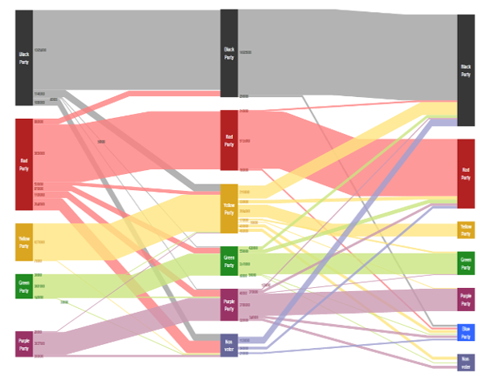

# Sankey Demo

[You can also run this demo online](https://live.yworks.com/demos/layout/sankey/index.html).

Sankey diagrams are used for visualizing flow information in which the thickness of the edges is proportional to the flow quantity. Such diagrams can be produced by means of the hierarchic layout algorithm (see [HierarchicLayout](https://docs.yworks.com/yfileshtml/#/api/HierarchicLayout)).

The example diagram shows a voters' migration flow between different political parties over the course of three elections (each column represents an election). The flow is depicted from left to right.

## Things to Try

Change the number displayed in each edge label to modify the thickness of a particular edge.

Right-click on a node to modify its color.

Use the dropdown to switch how the colors of edges are determined:

- With the 'outgoing' setting, it is easier to see where edges come from.
- With the 'incoming' setting, it is easier to see where edges go to.
