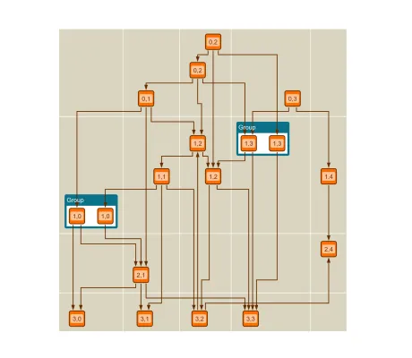

<!--
 //////////////////////////////////////////////////////////////////////////////
 // @license
 // This file is part of yFiles for HTML.
 // Use is subject to license terms.
 //
 // Copyright (c) by yWorks GmbH, Vor dem Kreuzberg 28,
 // 72070 Tuebingen, Germany. All rights reserved.
 //
 //////////////////////////////////////////////////////////////////////////////
-->
# Simple Layout Grid Demo

[You can also run this demo online](https://www.yworks.com/demos/layout/simplelayoutgrid/).

This demo shows how to create a simple [LayoutGrid](https://docs.yworks.com/yfileshtml/#/api/LayoutGrid) that will be used by the hierarchical layout algorithm.

The information about the desired position of a node in the layout grid is stored in its tag and also appears in its label. The first digit represents the row index and the second the column index.

The layout algorithm will calculate the positions of the nodes based on this information such that the nodes are assigned to the correct cell of the layout grid.
