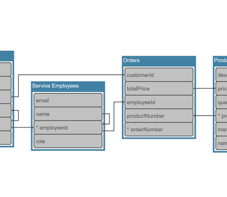

# Tabular Groups Demo

[You can also run this demo online](https://live.yworks.com/demos/layout/tabular-groups/index.html).

# Hierarchic Layout with Tabular Groups

This demo shows how to configure the [tabular groups](https://docs.yworks.com/yfileshtml/#/api/HierarchicLayoutData#tabularGroups) feature of the [Hierarchic Layout](https://docs.yworks.com/yfileshtml/#/api/HierarchicLayout).

Children of a _tabular group_ are placed in a compact tabular fashion, on the same hierarchical layer next to each other. A left-to-right layout orientation like in this demo results in child nodes being placed in a column-like way, one above the other.

Tabular groups have the benefit that they produce maximally compact group layouts. While for normal group nodes, other criteria like reducing edge bends are prioritized, this is not the case for tabular groups. A possible application is, for example, _entity–relationship_ diagrams showing relationships between entities of a database or other system.

In this demo, all groups are unconditionally treated as tabular groups. Nested tabular groups are supported, see the _UML_ sample diagram. In fact, any group which is a child of a tabular group automatically becomes a tabular one, too.

### Things to try

- Browse the provided **sample graphs**.
- **Enable and disable** the tabular groups feature using the toolbar button and observe the difference to the default hierarchic arrangement.
- See the effect of the **sorting** and **child distance** options. Note that if sorting by label text is enabled, the result may contain more edge crossings, because the order cannot be freely optimized.

### Code Snippet

You can copy the code snippet to configure the layout from [GitHub](https://github.com/yWorks/yfiles-for-html-demos/blob/master/demos/layout/tabulargroups/HierarchicLayoutTabularGroups.ts).
