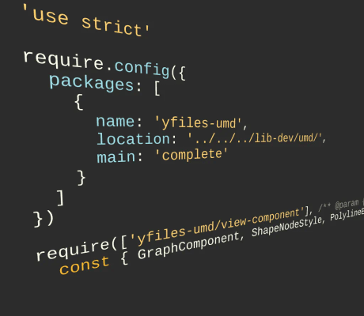

# Amd Loading Demo

[You can also run this demo online](https://live.yworks.com/demos/loading/amdloading/index.html).

This demo loads the yFiles module resources using the _require_ function that is defined in the AMD loading standard.

In order to run this demo, please run `npm install` in the demo folder. This will download the require.js AMD loader.

The default AMD Loader in use by this demo is the [RequireJS](https://requirejs.org/) loader.

Different AMD Loader implementations should work, too. E.g. in the sources of this page below you can find the configuration code for the loader included in the [dojo Toolkit](https://dojotoolkit.org/). This can easily be tested by commenting out the current loader and uncommenting the other loader.

Resources that have a _.js_ ending are loaded as JavaScript files. Loading a resource without the _.js_ postfix loads the resource as a module. Only the required top-level modules in the reference-tree have to be required explicitly. Dependent modules are resolved and loaded automatically without having to specify them.

Please take a look at the HTML sources of this document to see how to load modules using _require_.

Modules can be loaded dynamically at runtime when certain resources are needed. This improves the app's loading speed at startup. In order to observe dynamic loading at runtime, hit the _layout_ button. The modules _layout-hierarchic_ and _graph-layout-bridge_ needed for layout calculation are loaded when the button is hit for the first time. Please take a look at the demo's source code to see how dynamic loading works.
