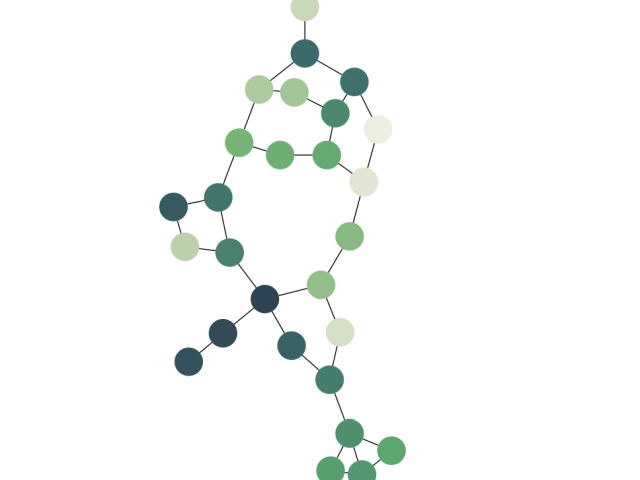

# Browserify Demo

This demo shows how to bundle the yFiles library in a [browserify](http://browserify.org/) project.

The yFiles modules are `require`d in the demo sources in addition to an `npm` library ([color](https://www.npmjs.com/package/color)), so browserify will add the yfiles modules and the npm library to the generated `bundle.js`.

The HTML file just references the single `bundle.js` file containing the demo code as well as all library code.

## Build

Install the required npm packages and run the build script

```
\> npm install
> npm run build

```

## Run

Browserify will place the output files in the `dist/` directory inside this demo's directory. To run the demo, open `./index.html` in a browser.
