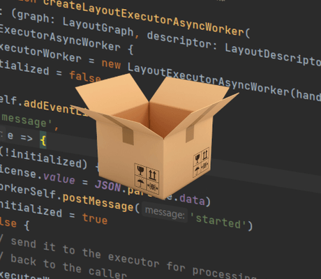

# Parcel Loading Demo

This demo loads the yFiles module using version 2 of [Parcel](https://parceljs.org/).

The layout is executed asynchronously using Parcel's built-in support for [Web Workers](https://parceljs.org/languages/javascript/#web-workers).

Using Parcel's [dependency resolution](https://parceljs.org/features/dependency-resolution/) resolution support and aliases, the license and other dependencies are configured without affecting the sources code.

## Running the demo

First, install the required npm modules in the demo directory:

```
\> npm install
```

Now the Parcel development server can be started:

```
\> npm run start
```

The Parcel development server will launch the [index file](http://localhost:1234) in a browser.

## Building the demo

Install the required npm packages and run the build script:

```
\> npm install
> npm run build
```
