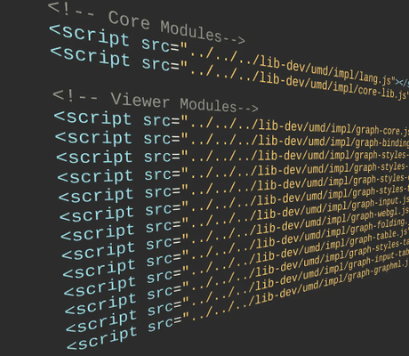

# Script Loading Demo

[You can also run this demo online](https://live.yworks.com/demos/loading/scriptloading/index.html).

# Script Loading Demo

This demo loads the yFiles modules using _<script>_ tags.

With script-tags, dependencies between the yFiles modules are not resolved automatically. Therefore, all modules that are used by an application have to be loaded separately and in the correct order, as shown in this [yFiles modules dependency diagram](https://docs.yworks.com/yfileshtml/#/dguide/introduction-modules).

## Deployment Tool

yFiles comes with a [deployment tool](https://docs.yworks.com/yfileshtml/#/dguide/deployment_tool) that can combine the yFiles modules into fewer or optionally even a single file. See the tool's documentation for details.

In order to improve code completion, install the UMD variant of yFiles locally as npm module.
