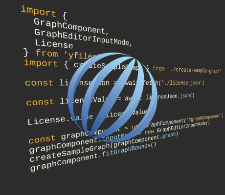

# Web Dev Server Loading Demo

This demo shows how to load yFiles for HTML with [Web Dev Server](https://modern-web.dev/docs/dev-server/overview/) as a loader for efficient web development and easy builds.

## Running the demo

First, install the required npm modules in the demo directory:

`> npm install`

Now the Web Dev Server can be started:

`> npm start`

The Web Dev Server will launch the [index file](http://localhost:8000) in a browser.
