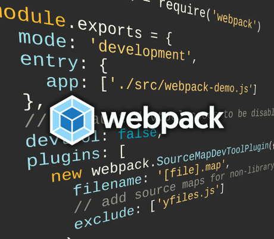

# Webpack Lazy Load yFiles Demo

This demo shows how to lazy load yFiles with [webpack](https://webpack.js.org/)'s [dynamic import](https://webpack.js.org/guides/code-splitting/) feature.

By default, webpack automatically tree-shakes yFiles and only includes the necessary modules in the bundle.

Additionally, this demo loads yFiles only if users click the 'Lazy Load yFiles' button of this demo.

Often, the diagram component is not needed for the initial startup of the application or can be loaded lazily in general in order to provide a better user experience. Thus, in this case, yFiles in only loaded when the diagram component of this application is requested.

Two fundamental concepts for webpack projects are demonstrated:

- [Dynamic import of modules](https://webpack.js.org/guides/code-splitting/)
- Separate webpack configurations for development and [production](https://webpack.js.org/guides/production-build/)

## Dynamic Imports with yFiles

There are two possible approaches:

- Create a separate diagram component that imports from the `yfiles` meta module.  
  This separate diagram component with yFiles can then be loaded dynamically on demand which is demonstrated in this application.
- yFiles can also be splitted down further, such that only specific [yFiles ES Module](https://docs.yworks.com/yfileshtml/#/dguide/yfiles-modules#es-modules) are loaded when needed, e.g. initially only load the yFiles view but lazy load the yFiles layout if needed.  
  This approach is shown in a separate webpack demo.

## Running the demo

First, install the required npm modules in the demo directory:

`> npm install`

### Development

For development, the [webpack dev server](https://github.com/webpack/docs/wiki/webpack-dev-server) offers convenient live reloading support to minimize turnaround times.

The dev server will serve the webpack bundles from memory (no bundles will be created on disc), update the app bundle and refresh the page when changes are made to the source files.

To run the dev server:

`> npm start`

The webpack dev server will create the bundles in memory and launch the [generated index file](http://localhost:9003/) in a browser.

Note that the npm start script will run webpack once before starting the webpack dev server, so the generated index.html file already exists when the browser first tries to access it.

When the server runs, try making changes to `src/webpack-demo.js` and see how the app will be updated in the browser immediately.

Debugging of application files in the browser's developer tools should work fine, as source maps are enabled using webpack's "[SourceMapDevToolPlugin](https://webpack.js.org/plugins/source-map-dev-tool-plugin/)".

### Production

The following build steps are specific to the production configuration:

- Append a content-based hash to the bundle filename to enable long-term caching.
- [Minify](https://webpack.js.org/guides/production-build/#minification) the bundles using webpack's minification plugin.

To run the production build:

`> npm run production`

Note that the final minification step of the production build may take some time (the first "done" message is misleading).
