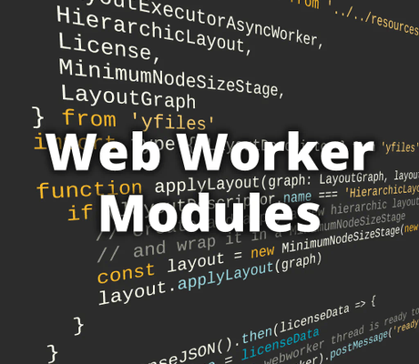

# Web Worker Demo (Modules)

[You can also run this demo online](https://live.yworks.com/demos/loading/webworker-modules/index.html).

# Web Worker Demo (Modules)

This demo shows how to run a layout algorithm in a Web Worker thread without blocking the UI or main thread.

The demo code uses [module workers](https://web.dev/module-workers/), which are not supported in every browser, yet. If your browser does not support module workers, please refer to the [Webpack Demo](../../loading/webpack/README.html) for an approach using Web Worker together with webpack, or the [Web Worker UMD Demo](../../loading/webworker-umd/index.html) that uses AMD modules to load resources in the Web Worker thread.

Calculating the layout in a Web Worker keeps the UI responsive. Hence, the loading animation is able to continue while the layout algorithm is working.

See the sources for details.
