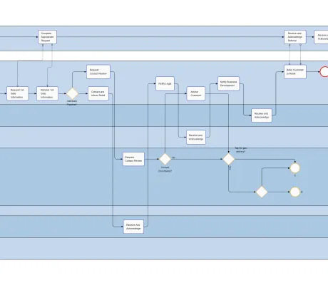

<!--
 //////////////////////////////////////////////////////////////////////////////
 // @license
 // This file is part of yFiles for HTML.
 // Use is subject to license terms.
 //
 // Copyright (c) 2026 by yWorks GmbH, Vor dem Kreuzberg 28,
 // 72070 Tuebingen, Germany. All rights reserved.
 //
 //////////////////////////////////////////////////////////////////////////////
-->
# BPMN Graph Editor

[You can also run this demo online](https://www.yfiles.com/demos/showcase/bpmn/).

An editor for Business Process Diagrams (BPMN).

You can interactively modify the diagram and automatically arrange it with the specialized BPMN layout algorithm.

## Things to Try

- Choose a sample diagram from the toolbar combo box.
- Drag node templates from the palette to the canvas to create different BPMN items.
- Connect the items by dragging from an unselected node to another one.
- Auto-arrange the changed diagram with the BPMN layout algorithm.
- Open a popup menu that allows you to customize the item by double-click a node, edge or boundary event. Double-clicking on an empty space closes any open popup.
- Open a context menu by right-clicking a node or edge. The menu provides different actions depending on the clicked item.
- Edit the label of a selected node or edge by pressing F2. Note that you can also select the label directly using the detail selection (Shift + click).
- Add an additional label to a selected node or edge by pressing Shift + F2.
