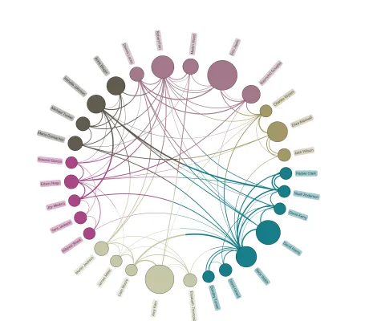

<!--
 //////////////////////////////////////////////////////////////////////////////
 // @license
 // This file is part of yFiles for HTML.
 // Use is subject to license terms.
 //
 // Copyright (c) by yWorks GmbH, Vor dem Kreuzberg 28,
 // 72070 Tuebingen, Germany. All rights reserved.
 //
 //////////////////////////////////////////////////////////////////////////////
-->
# Non-ribbon Chord Diagram

[You can also run this demo online](https://www.yfiles.com/demos/showcase/chord-diagram-non-ribbon/).

This demo shows how to create a non-ribbon chord diagram. In contrast to the normal [Chord Diagram Demo](../../showcase/chord-diagram/), these diagrams use clearly separated nodes and edges, so it can be easier to see the individual connections.

This demo illustrates email communication between employees of a fictitious company.

The layout of the graph is calculated with the [circular layout](https://docs.yworks.com/yfileshtml/#/dguide/circular_layout#circular_layout). The color of the nodes represents the department to which each employee belongs. Each edge has the two colors of its source and target. The thickness of the edge is proportional to the number of e-mails exchanged between the two nodes.

## Things to try

- Switch between the label styles ray-like and horizontal.
- Hover over a node to see the position and the department of an employee.
