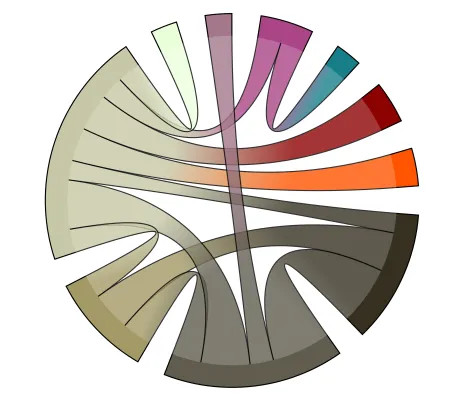

<!--
 //////////////////////////////////////////////////////////////////////////////
 // @license
 // This file is part of yFiles for HTML.
 // Use is subject to license terms.
 //
 // Copyright (c) 2026 by yWorks GmbH, Vor dem Kreuzberg 28,
 // 72070 Tuebingen, Germany. All rights reserved.
 //
 //////////////////////////////////////////////////////////////////////////////
-->
# Chord Diagram

[You can also run this demo online](https://www.yfiles.com/demos/showcase/chord-diagram/).

This demo shows how to arrange and visualize a graph as a chord diagram.

In a chord diagram, the nodes are arranged on a circle and the edges are drawn as arcs. In this demo, nodes are visualized as circle segments, and both the size of the nodes and thickness of the edges reflects their weight or value.

This demo presents a custom layout algorithm implementation for this layout style and corresponding styles for the nodes and edges.

## Things to try

- Increase the size of the gaps between the nodes with the toolbar slider.
- Hover over a circle segment to highlight its corresponding edges.
- Hover over an edge to bring it to front.
- Select an edge and adjust its thickness with the toolbar slider.
- Toggle the 'Show Graph' button to see the raw result of the layout algorithm in contrast to the final visual styling of the nodes and edges.
