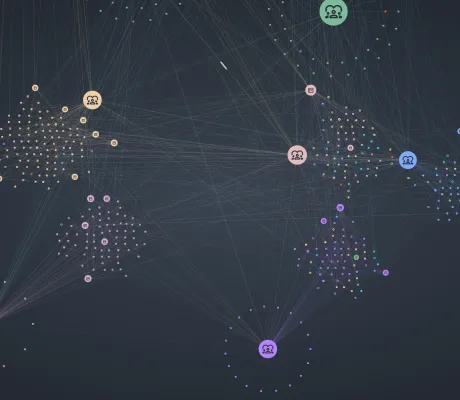

<!--
 //////////////////////////////////////////////////////////////////////////////
 // @license
 // This file is part of yFiles for HTML.
 // Use is subject to license terms.
 //
 // Copyright (c) 2026 by yWorks GmbH, Vor dem Kreuzberg 28,
 // 72070 Tuebingen, Germany. All rights reserved.
 //
 //////////////////////////////////////////////////////////////////////////////
-->
# Interactive Knowledge Graph Demo

[You can also run this demo online](https://www.yfiles.com/demos/showcase/knowledge-graphs/).

This demo visualizes a knowledge graph and highlights potential data issues, offering interactive tools to inspect and fix them.

Knowledge graph data are typically stored as triples (subject–predicate–object). Because triples can come from different sources and formats, common problems include duplicated nodes, edges connected to the wrong endpoints, and isolated nodes.

Use the right panel to locate detected problems and apply fixes directly. Alternatively, select nodes or edges in the graph and use the context menu (right‑click) to repair them.

## Things to try

- Open the right sidebar to see a list of detected problems. For each problem, you can either zoom to the affected node(s) or apply an automatic fix.
- Enable 'Spotlight all issues' to mark all problematic elements using a beacon animation (available only if the browser supports WebGL).
- Merge duplicated nodes (copy_all) to consolidate identical entities into a single node.
- Remove isolated nodes (error) that are not connected to the rest of the graph.
- Fix edges with incorrect endpoints (warning) by selecting the edge and reconnecting its ports to the correct node(s).
- Double-click on a node to open the neighborhood view panel showing all its direct neighbors.
- Switch layout with the **Group By Teams** toolbar button: This groups nodes that belong to the same team next to each other for easier inspection.
- Use the **Triplet Filtering** panel to filter-out or fade-out parts of the graph based on selected triples (subject, predicate, or object). Note that 'fade-out' operation is only available if the browser supports WebGL.
