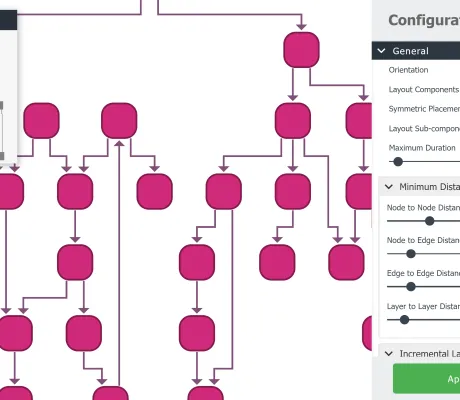

<!--
 //////////////////////////////////////////////////////////////////////////////
 // @license
 // This file is part of yFiles for HTML.
 // Use is subject to license terms.
 //
 // Copyright (c) by yWorks GmbH, Vor dem Kreuzberg 28,
 // 72070 Tuebingen, Germany. All rights reserved.
 //
 //////////////////////////////////////////////////////////////////////////////
-->
# Layout Styles Demo

[You can also run this demo online](https://www.yworks.com/demos/showcase/layoutstyles/).

This demo showcases the most used layout algorithms of yFiles, including hierarchical, organic, orthogonal, tree, circular, radial tree, and several edge routing styles.

The configuration panel provides access to the settings of each algorithm. Typically, an algorithm allows even more options in code.

Since not every layout style works well for every type of graph, we provide several suitable sample graphs.

The interactive editing capabilities of the graph component of this demo are explained in the [Graph Editor Demo](../../view/grapheditor/).

## Things to Try

- Browse the _Layout Algorithms_ and _Sample Graphs_.
- Explore and apply the settings of the layout algorithms.
- Try a preset configuration to explore different aspects of the layout algorithms.

## Layout Description
