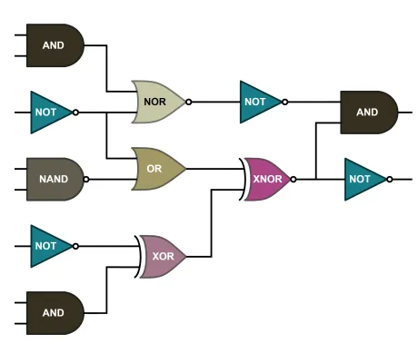

<!--
 //////////////////////////////////////////////////////////////////////////////
 // @license
 // This file is part of yFiles for HTML.
 // Use is subject to license terms.
 //
 // Copyright (c) by yWorks GmbH, Vor dem Kreuzberg 28,
 // 72070 Tuebingen, Germany. All rights reserved.
 //
 //////////////////////////////////////////////////////////////////////////////
-->
# Logic Gates Demo

[You can also run this demo online](https://www.yfiles.com/demos/showcase/logicgates/).

This demo shows how to use yFiles for HTML to visualize a digital system with logic gates.

Each node has specific ports: incoming edges connect only to the left side of the target node, while outgoing edges originate only from the right side of the source node.

## Graph Creation

A specialized [GraphBuilder](https://docs.yworks.com/yfileshtml/#/api/GraphBuilder) from the [Port-aware Graph Builder Demo](../../databinding/port-aware-graph-builder/) is used to create the graph, connecting the edges with specific ports defined in the business data.

## Things to Try

- Drag nodes from the palette and connect them with edges.
- Create a new edge: this highlights the possible end ports with green color.
- Hover over a node to see available input (reddish color) and output (bluish color) ports
- Reassign a connection by selecting the edge and dragging its endpoint.
- The ports remain unchanged when applying the selected layout algorithm.
