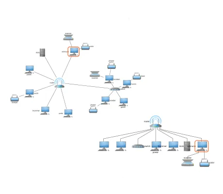

<!--
 //////////////////////////////////////////////////////////////////////////////
 // @license
 // This file is part of yFiles for HTML.
 // Use is subject to license terms.
 //
 // Copyright (c) by yWorks GmbH, Vor dem Kreuzberg 28,
 // 72070 Tuebingen, Germany. All rights reserved.
 //
 //////////////////////////////////////////////////////////////////////////////
-->
# Neighborhood View Demo

[You can also run this demo online](https://www.yworks.com/demos/showcase/neighborhood/).

The Neighborhood demo shows the neighborhood of the currently selected node alongside the graph. The neighborhood view is a filtered copy of the original graph. There are different modes for the neighborhood computation. The currently selected node is highlighted inside the neighborhood view.

The following neighborhood types are available:

- Predecessors
- Successors
- Both (predecessors and successors)
- Neighbors (independent of the edge direction)
- Folder (content of a folder node, independently from its collapse/expand state)

## Things to Try

- Choose a graph using the select box.
- Change the neighborhood type of the view.
- Change the max-depth parameter to limit the neighborhood computation up to a certain depth.
- Navigate the graph by clicking nodes in the neighborhood view.

## Remarks

- The neighborhood view is using a [HierarchicalLayout](https://docs.yworks.com/yfileshtml/#/api/HierarchicalLayout) on the filtered graph.
