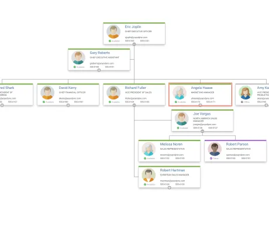

<!--
 //////////////////////////////////////////////////////////////////////////////
 // @license
 // This file is part of yFiles for HTML.
 // Use is subject to license terms.
 //
 // Copyright (c) by yWorks GmbH, Vor dem Kreuzberg 28,
 // 72070 Tuebingen, Germany. All rights reserved.
 //
 //////////////////////////////////////////////////////////////////////////////
-->
# Organization Chart Demo

[You can also run this demo online](https://www.yfiles.com/demos/showcase/orgchart/).

This demo shows how to create an interactive organization chart from JSON data.

The source data is easily converted to a yFiles graph using class [TreeBuilder](https://docs.yworks.com/yfileshtml/#/api/TreeBuilder).

The visualization of the employee is defined by an svg-template which is interpreted by the node style using the [Vue 2 framework](https://vuejs.org/v2/guide/index.html).

The demo also shows how a [FilteredGraphWrapper](https://docs.yworks.com/yfileshtml/#/api/FilteredGraphWrapper) can be used to display a subgraph of the model graph.

## Automatic Layout

The organization chart is arranged automatically with the [TreeLayout](https://docs.yworks.com/yfileshtml/#/api/TreeLayout) and the [CompactSubtreePlacer](https://docs.yworks.com/yfileshtml/#/api/CompactSubtreePlacer) which determines the best arrangement strategy for each node in order to achieve a compact and clear layout.

## Organization Chart View

Mouse Wheel

Changes the zoom level of the view.

Click on Employee

Selects the employee in the chart and shows the corresponding data in the properties view.

## Properties View

Click on a superior, subordinate, or colleague link to select and zoom to the corresponding node in the organization chart.

## Things to Try

- Click on the port to hide and show the children, you can **hide children** by clicking on  and you can **show children** by clicking on .
- Right click on the node to see the **context menu**. For the selected node you can:
- - Hide parent: hides the parent of the currently selected employee.
  - Show parent: shows the parent of the currently selected employee.
  - Hide children: hides the children of the currently selected employee.
  - Show children: Shows the children of the currently selected employee.
  - Show all: show all employees
- In the Toolbar, you can **Show All** nodes by clicking on .

## Developer Information

- To load your own data into the demo, replace the data in the `./model/orgchart-data.ts` file. If your data is structured differently, change the `buildGraph()` function in the `./model/data-loading.ts` file and/or the `Employee` type.
- To disable interactivity, remove the `initializeInteractivity()` call in `./input.ts.`
- To use the collapsing feature in your own application, copy the `./CollapsibleTree.ts` file and, for interactivity, the `./input.ts` and `./ui/orgchart-context-menu.ts` files.
- To use the search feature in your own application, copy the `./OrgChartGraphSearch.ts` and `../utils/GraphSearch.ts` files.
