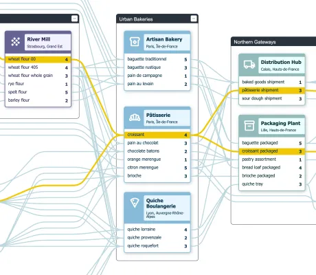

<!--
 //////////////////////////////////////////////////////////////////////////////
 // @license
 // This file is part of yFiles for HTML.
 // Use is subject to license terms.
 //
 // Copyright (c) 2026 by yWorks GmbH, Vor dem Kreuzberg 28,
 // 72070 Tuebingen, Germany. All rights reserved.
 //
 //////////////////////////////////////////////////////////////////////////////
-->
# Supply Chain Demo

[You can also run this demo online](https://www.yfiles.com/demos/showcase/supply-chain/).

This demo visualizes a bakery supply chain in France. The graph’s nodes represent single facilities and list the items produced at that location, including the current stock. The edges between products describe product flows.

Click on any product or edge to highlight the corresponding product flow. Try for yourself! Highlight all products containing eggs:

Use the plus button next to a product to increase its stock, which triggers a decrease in stock of all ingoing products. Feel free to try to produce some croissants:

You will notice once products run out of stock. Now it’s time for you to keep the supply chain running. Have fun exploring!
