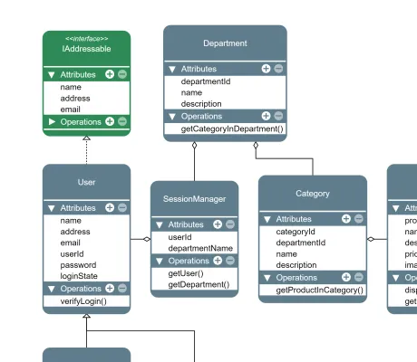

<!--
 //////////////////////////////////////////////////////////////////////////////
 // @license
 // This file is part of yFiles for HTML.
 // Use is subject to license terms.
 //
 // Copyright (c) by yWorks GmbH, Vor dem Kreuzberg 28,
 // 72070 Tuebingen, Germany. All rights reserved.
 //
 //////////////////////////////////////////////////////////////////////////////
-->
# UML Editor Demo

[You can also run this demo online](https://www.yworks.com/demos/showcase/uml/).

The UML Editor demo showcases a custom UML node style that renders an UML data set. Additional control elements are provided to conveniently add/remove entries and to create different type of UML edges as well as toggling the node's 'interface' or 'abstract' state.

The node style uses an [StretchLabelModel](https://docs.yworks.com/yfileshtml/#/api/StretchLabelModel) to stack the UML entries on top of each other. A custom [IEditLabelHelper](https://docs.yworks.com/yfileshtml/#/api/IEditLabelHelper) is provided by the UML node style to enable editing of the different UML entries.

## Things to Try

- Click a node to bring up additional control elements.
- Create UML specific edges by dragging one of the edge creation controls. A layout will route the new edge when the edge creation has finished.
- Entries can be added/removed with the '+' and '-' buttons on the respective header section.
- Toggle the node's 'interface' or 'abstract' state with the 'I' or 'A' buttons.
- The layout button in the toolbar will create a new layout from scratch and bundle inheritance edges.
