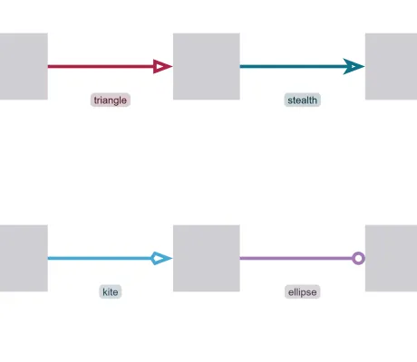

<!--
 //////////////////////////////////////////////////////////////////////////////
 // @license
 // This file is part of yFiles for HTML.
 // Use is subject to license terms.
 //
 // Copyright (c) by yWorks GmbH, Vor dem Kreuzberg 28,
 // 72070 Tuebingen, Germany. All rights reserved.
 //
 //////////////////////////////////////////////////////////////////////////////
-->
# Arrow Demo

[You can also run this demo online](https://www.yfiles.com/demos/style/arrow/).

The [Arrow](https://docs.yworks.com/yfileshtml/#/api/Arrow) class provides several properties to customize arrows. It can render [ArrowType](https://docs.yworks.com/yfileshtml/#/api/ArrowType)s and visualize different arrow shapes. This demo demonstrates edges with all arrow types specified in the edge labels.

Besides shapes, arrows can also be customized by changing its [color](https://docs.yworks.com/yfileshtml/#/api/Arrow#fill), [outline](https://docs.yworks.com/yfileshtml/#/api/Arrow#stroke) and [length](https://docs.yworks.com/yfileshtml/#/api/Arrow#length). The [widthScale](https://docs.yworks.com/yfileshtml/#/api/Arrow#widthScale) and [lengthScale](https://docs.yworks.com/yfileshtml/#/api/Arrow#lengthScale) of arrows can also be adjusted to change its aspect ratio.

One can also create custom arrows by implementing a visualization based on the [IArrow](https://docs.yworks.com/yfileshtml/#/api/IArrow) interface. See _Step 12: Custom Arrow_ in [Step Tutorial: Edge Style Implementation](../../tutorial-style-implementation-edge/01-create-a-polyline/) for an example implementation.

## Things to Try

- Drag the _Edge Thickness_ slider in the toolbar to observe the change of edge thickness and arrow sizes.
- Switch between "filled" and "outlined" using the _Arrow Style_ dropdown menu in the toolbar to observe the arrow style with or without fill.
- Create new edges between nodes in the graph to observe the random arrows on the newly created edges.
