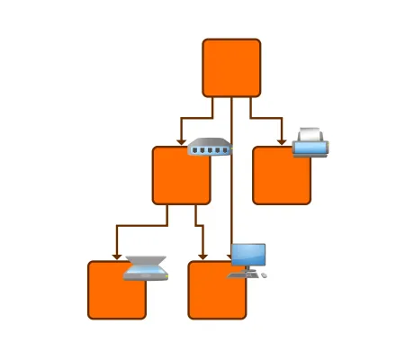

<!--
 //////////////////////////////////////////////////////////////////////////////
 // @license
 // This file is part of yFiles for HTML.
 // Use is subject to license terms.
 //
 // Copyright (c) 2026 by yWorks GmbH, Vor dem Kreuzberg 28,
 // 72070 Tuebingen, Germany. All rights reserved.
 //
 //////////////////////////////////////////////////////////////////////////////
-->
# Clickable Style Decorator Demo

[You can also run this demo online](https://www.yfiles.com/demos/style/clickable-style-decorator/).

This demo illustrates an approach on how to handle clicks on specific areas of the style.

In this case, clicks on the style decorator are handled even in the area that extends over the rectangular node bounds.

See the sources for details.
