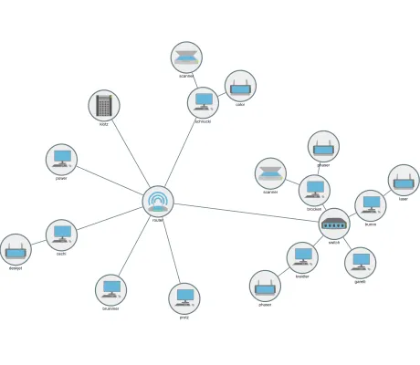

<!--
 //////////////////////////////////////////////////////////////////////////////
 // @license
 // This file is part of yFiles for HTML.
 // Use is subject to license terms.
 //
 // Copyright (c) by yWorks GmbH, Vor dem Kreuzberg 28,
 // 72070 Tuebingen, Germany. All rights reserved.
 //
 //////////////////////////////////////////////////////////////////////////////
-->
# Composite Node Style Demo

[You can also run this demo online](https://www.yfiles.com/demos/style/composite-node-style/).

This demo shows how to combine node visualizations from several styles into one.

This is achieved with a composite node style, i.e., a custom node style implementation that combines the visualizations from several other node style instances into a composite visual.

See the sources for details.
