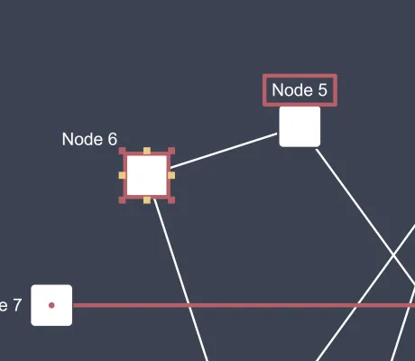

<!--
 //////////////////////////////////////////////////////////////////////////////
 // @license
 // This file is part of yFiles for HTML.
 // Use is subject to license terms.
 //
 // Copyright (c) by yWorks GmbH, Vor dem Kreuzberg 28,
 // 72070 Tuebingen, Germany. All rights reserved.
 //
 //////////////////////////////////////////////////////////////////////////////
-->
# CSS Styling Demo

[You can also run this demo online](https://www.yworks.com/demos/style/cssstyling/).

This demo shows how to style the built-in templates and UI elements of the _yFiles for HTML_ library with CSS to match your color theme.

There is a separate CSS-stylesheet which contains the more information about this demo.

## CSS-Styling for the following Elements

- Viewport rectangle in the Overview
- Highlight when hovering a graph element
- Selection indicator for the graph elements
- Focus indicator for the graph elements
- Marquee selection rectangle
- Resize handles
- Label candidates when dragging a label
- Port candidates
- Tooltips
- Snap-lines
- Scroll-bars
- Label Editor

## CSS-Transitions for the following Elements

- Node Creation
- Tooltips
- Label editor
