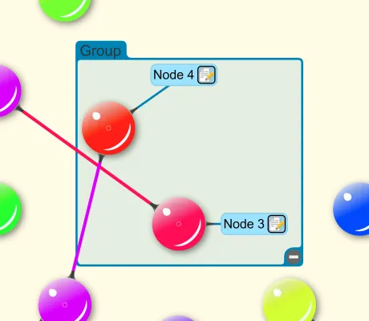

<!--
 //////////////////////////////////////////////////////////////////////////////
 // @license
 // This file is part of yFiles for HTML.
 // Use is subject to license terms.
 //
 // Copyright (c) 2026 by yWorks GmbH, Vor dem Kreuzberg 28,
 // 72070 Tuebingen, Germany. All rights reserved.
 //
 //////////////////////////////////////////////////////////////////////////////
-->
# Custom Styles Demo

[You can also run this demo online](https://www.yfiles.com/demos/style/customstyles/).

This demo shows how to create custom styles for nodes, edges, labels, ports, and edge arrows. Styles can use all the powerful visualisation features of Scalable Vector Graphics (SVG).

Two samples are offered, each using a different set of custom style implementations.

## Samples

## Description

Uses the style implementations

- _Sample1NodeStyle_
- _Sample1EdgeStyle_
- _Sample1LabelStyle_
- _Sample1GroupNodeStyle_
- _Sample1PortStyle_
- _Sample1Arrow_

## Things to try

- Create new nodes in the canvas and inspect their styles in code.
- Create edges between nodes and inspect the custom style of the edge and the arrows in code.
- Click "Modify Colors" to change the color of the nodes and indirectly the color of the outgoing edges.
- Note that the labels look like nodes connected via an edge, however they are ordinary labels that reuse the edge style for drawing a node to label connection. Select and drag a label to move them to different locations.
- Also note that the label style depends on the current zoom. Zooming closer to the label reveals an edit label button that, when clicked, starts label text editing.
- Selecting an edge changes its color - the traditional selection indicator is not rendered.

## Description

Uses the style implementations

- _Sample2NodeStyle_
- _Sample2EdgeStyle_
- _Sample2GroupNodeStyle_
- _Sample2Arrow_

## Things to try

- Create new nodes in the canvas and inspect their styles in code.
- Create edges between nodes and inspect the custom style of the edge and the arrows in code.
- The styles offer a _cssClass_ property so that the items may easily be styled via CSS. See the rules (e.g. .node-color) defined in the _index.html_.
- Save the sample to graphml by clicking the button in the toolbar. Inspect the markup extension implementations necessary to support graphml (e.g. _DemoNodeStyleExtension_).
