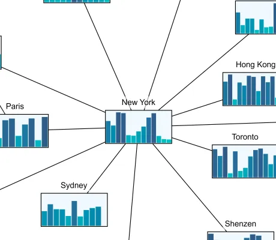

<!--
 //////////////////////////////////////////////////////////////////////////////
 // @license
 // This file is part of yFiles for HTML.
 // Use is subject to license terms.
 //
 // Copyright (c) 2026 by yWorks GmbH, Vor dem Kreuzberg 28,
 // 72070 Tuebingen, Germany. All rights reserved.
 //
 //////////////////////////////////////////////////////////////////////////////
-->
# d3 Chart Nodes Demo

[You can also run this demo online](https://www.yfiles.com/demos/style/d3chartnodes/).

The [d3.js](https://d3js.org/) library allows for flexible and powerful visualizations of data in the context of HTML, SVG, and CSS. For this demo, we used _d3.js_ to create an [INodeStyle](https://docs.yworks.com/yfileshtml/api/INodeStyle) that displays dynamically changing data as a bar chart.
