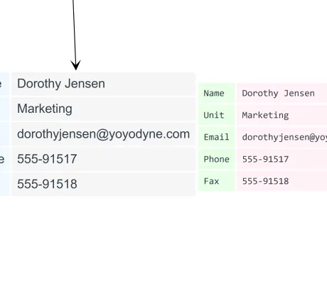

<!--
 //////////////////////////////////////////////////////////////////////////////
 // @license
 // This file is part of yFiles for HTML.
 // Use is subject to license terms.
 //
 // Copyright (c) by yWorks GmbH, Vor dem Kreuzberg 28,
 // 72070 Tuebingen, Germany. All rights reserved.
 //
 //////////////////////////////////////////////////////////////////////////////
-->
# Data Table Demo

[You can also run this demo online](https://www.yworks.com/demos/style/datatable/).

This demo shows a node style and a label style that display data in a tabular fashion.

## Things to Try

- Resize a node: If the node is smaller than the table, scrollbars can be used to scroll the node content.
- Toggle labels for all nodes with the toolbar button.

## Description

- Labels measure their content and resize to the minimum bounds.
- The HTML table can be styled with CSS in the `index.html` file.
- Node and Label HTML markup has the CSS classes `data-table-node` and `data-table-label` and can therefore be styled differently.
