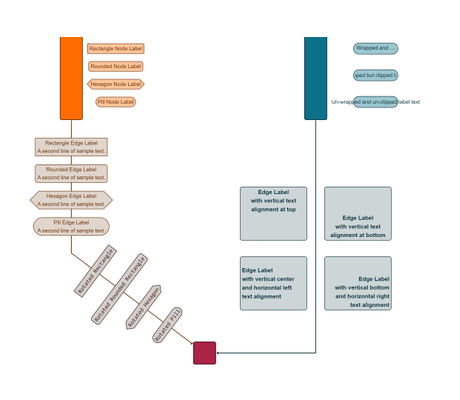

# Default Label Style Demo

[You can also run this demo online](https://live.yworks.com/demos/style/default-label-style/index.html).

# Default Label Style Demo

This demo shows the most important configuration options for the built-in [DefaultLabelStyle](https://docs.yworks.com/yfileshtml/#/api/DefaultLabelStyle) class.

## Things to Try

- Observe the various pre-configured label styles that are using different label _shapes_, different _colors_, _fonts_ and other settings. Hover over a label to get a tool tip that lists the configured properties.
- Edit labels interactively and observe how the background shapes adjust to the new text bounds.
- Move nodes or edge bends and observe how the label rendering interacts with label rotation.
- Take a look at labels showing the _text alignment_ features. This comes into play when the preferred size of the label is larger than the size needed for the text.
- The three light-blue node labels on the right show the effects of _text wrapping_ and _text clipping_ for labels whose size is smaller than the size needed for displaying the whole text. To learn more about wrapping, please see the [Label Text Wrapping Tutorial](../../03-tutorial-application-features/label-text-wrapping/index.html).

## Related Demos

- [HTML Label](../htmllabel/index.html)
- [Markdown Label](../markdownlabel/index.html)
- [Rich Text Label](../richtextlabel/index.html)
- [Tutorial: Custom Label Style](../../02-tutorial-custom-styles/10-custom-label-style/index.html)
