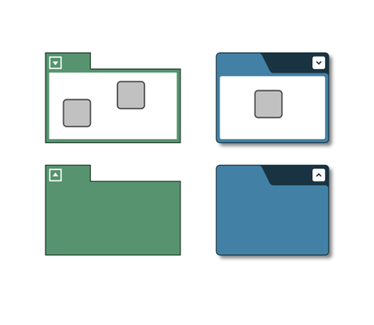

# Group Node Style Demo

[You can also run this demo online](https://live.yworks.com/demos/style/group-node-style/index.html).

# Group Node Style Demo

[GroupNodeStyle](https://docs.yworks.com/yfileshtml/#/api/GroupNodeStyle) is a style primarily intended for groups and folders, i.e., collapsed groups.

This style offer many configuration options for customizing its look. Please see chapter [GroupNodeStyle](https://docs.yworks.com/yfileshtml/#/dguide/styles-node_styles#styles-GroupNodeStyle) in the Developer's Guide and the [GroupNodeStyle](https://docs.yworks.com/yfileshtml/#/api/GroupNodeStyle) API documentation for more detailed information.

The related [GroupNodeLabelModel](https://docs.yworks.com/yfileshtml/#/api/GroupNodeLabelModel) places node labels inside the tab or the background area next to the tab of a group or folder when used together with `GroupNodeStyle`.

## Things to try

- Click the expansion state icons  
              
  to collapse groups or expand folders.
- Double-click a group or a folder. This will collapse a group and expand a folder even if there is no expansion state icon.
- When using the SVG style, move the mouse over one of the expansion state icons. The icon will slightly increase in size in response to the mouse hovering over it.  
  This CSS transition effect is specified in the demo's local <style> definition.
- When using SVG styles, collapse a group or expand a folder with a chevron or triangle icon. The expansion state icon will change in an animated fashion in response to the state change.  
  This CSS transition effect is specified in the demo's local <style> definition.

## Related Demos

- [Shape Node Style](../shape-node-style/index.html)
- [Rectangle Node Style](../rectangle-node-style/index.html)
- [Arrow Node Style](../arrow-node-style/index.html)
- [Tutorial: Custom Node Style](../../02-tutorial-custom-styles/01-custom-node-style/index.html)
