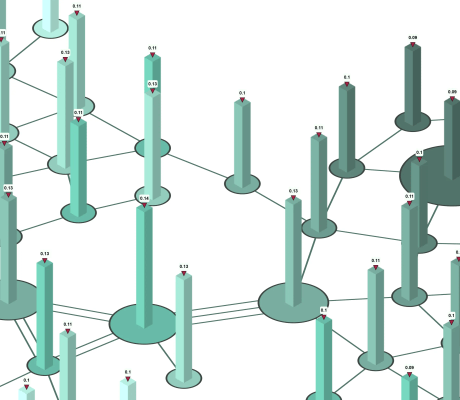

# Isometric Bar Chart Node Style

[You can also run this demo online](https://live.yworks.com/demos/style/isometric-bar-chart-style/index.html).

## Isometric Bar-Chart Augmentation

This demo shows how a diagram can be augmented with isometric bars providing additional information about the nodes.

In order to achieve this, the style from the isometric drawing demo is reused and rendered as an additional visualization for nodes. Similarly, another node style is put on top to render the label. These styles are added using their own [GraphModelManager](https://docs.yworks.com/yfileshtml/#/api/GraphModelManager)

## Things to Try

- Try the other options for _Augmented Information_ to see the bars adjust to the provided information.
- Toggle label visibility in the toolbar
- Change the _Augmented Information_ to _None_ to see the original graph without the augmentations.

See the sources for details.
