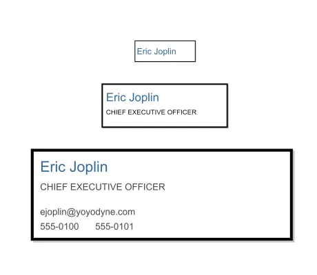

<!--
 //////////////////////////////////////////////////////////////////////////////
 // @license
 // This file is part of yFiles for HTML.
 // Use is subject to license terms.
 //
 // Copyright (c) 2026 by yWorks GmbH, Vor dem Kreuzberg 28,
 // 72070 Tuebingen, Germany. All rights reserved.
 //
 //////////////////////////////////////////////////////////////////////////////
-->
# Level of Detail Style Demo

[You can also run this demo online](https://www.yfiles.com/demos/style/level-of-detail-style/).

This demo shows how to display different styles depending on the current zoom level in order to implement a level of detail rendering.

In this demo three levels of zooming are implemented: **detail level**, **intermediate level** and **overview level**

- In **detail level**, the entire information is displayed on the node.
- In **intermediate level**, some of the node's information is rendered.
- In **overview level**, only the basic information is rendered.

## Things to Try

Zoom in and out to see the changes.
