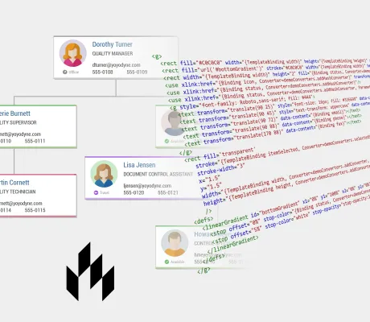

<!--
 //////////////////////////////////////////////////////////////////////////////
 // @license
 // This file is part of yFiles for HTML.
 // Use is subject to license terms.
 //
 // Copyright (c) by yWorks GmbH, Vor dem Kreuzberg 28,
 // 72070 Tuebingen, Germany. All rights reserved.
 //
 //////////////////////////////////////////////////////////////////////////////
-->
# Lit Template Node Style Demo

[You can also run this demo online](https://www.yfiles.com/demos/style/lit-template-node-style/).

This demo presents the LitNodeStyle that leverages the powerful data binding and conditional rendering features of the [Lit templating framework](https://lit.dev/).

With this style, node visualizations are defined by SVG snippet rendering functions. These rendering functions are powered by the Lit template string technology, which makes it easy to componentize, create, and efficiently update SVG DOM snippets.

## Things to Try

Change the render function of one or more nodes. Bind colors or text to properties in the tag. Then, apply the new template by pressing the button. Or modify the tag and see how the visualization changes.

## Related Demos

- [Vue Component Node Style Demo](../../../demos-ts/style/vue-component-node-style/README.html)
- [Vue Template Node Style Demo](../../../demos-ts/style/vue-template-node-style/README.html)
- [React Component Node Style Demo](../../../demos-ts/style/react-component-node-style/README.html)
- [React JSX Component Style Demo](../../../demos-ts/style/react-template-node-style/README.html)
