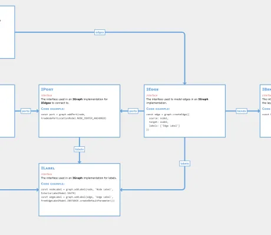

<!--
 //////////////////////////////////////////////////////////////////////////////
 // @license
 // This file is part of yFiles for HTML.
 // Use is subject to license terms.
 //
 // Copyright (c) by yWorks GmbH, Vor dem Kreuzberg 28,
 // 72070 Tuebingen, Germany. All rights reserved.
 //
 //////////////////////////////////////////////////////////////////////////////
-->
# Markdown Label Demo

[You can also run this demo online](https://www.yworks.com/demos/style/markdownlabel/).

This demo shows how to create labels using Markdown syntax.

The label style implementation `MarkdownLabelStyle` uses [markdown-it](https://github.com/markdown-it/markdown-it) to transpile Markdown syntax into HTML. The actual rendering of the HTML text is done by `MarkupLabelStyle`.

## Label Editor

#### Creating and Editing Labels

- Press the F2 key while an element or connection is selected.
- Insert Markdown text into the editor, i.e. `**Hello World**`.
- Press Shift + Enter to enter a newline.

#### Supported Markdown

The Markdown elements supported by this style labels are

- \# Headings
- \*emphasis\* and \*\*strong\*\* text
- ~~strikethrough~~ text
- \`code\` and  
  \`\`\`  
  code blocks  
  \`\`\`
- Newlines, with trailing backslash\\
- Paragraphs, using two subsequent newlines

#### Styling Labels with CSS

Since the markdown label style delegates to `MarkupLabelStyle` for rendering, elements can be styled with CSS classes.

The stylesheet for labels _markdown-label.css_ shows how the label texts are styled with external CSS.

#### Text Wrapping

Markdown labels can use line wrapping. In this demo application, the labels use word wrapping with ellipsis. Select and resize a node to observe the interactive text wrapping. Markdown labels can also be wrapped at character boundaries.

## Related Demos

- [Label Style Demo](../../style/label-style/)
- [HTML Label Style Demo](../../style/html-label-style/)
- [Rich Text Label Demo](../../style/richtextlabel/)
- [Step 01 Rendering the Label Text](../../tutorial-style-implementation-label/01-render-label-text/)
