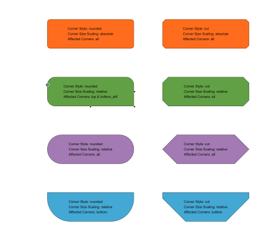

# Rectangle Node Style Demo

[You can also run this demo online](https://live.yworks.com/demos/style/rectangle-node-style/index.html).

# Rectangle Node Style Demo

The [RectangleNodeStyle](https://docs.yworks.com/yfileshtml/#/api/RectangleNodeStyle) class can display a variety of shapes including rectangles with rounded and cut corners, hexagons, octagons, pills, half-circles, and more.

This is made possible by numerous configuration options for the representation of the node corners. This demo allows you to interactively explore those options. The current configuration of each node is shown as label.

## Things to Try

- Change some of the settings in the property panel on the right-hand side while a node is selected and see how it affects the selected node.
- Resize a selected node via its round handles and see how the shape changes based on the value of [Scale Corner Size](https://docs.yworks.com/yfileshtml/#/api/RectangleNodeStyle#scaleCornerSize).
- Drag the rectangular handle of a selected node to change its [Corner Size](https://docs.yworks.com/yfileshtml/#/api/RectangleNodeStyle#cornerSize) interactively. A blue rectangle will be displayed during the drag that visualizes the top-left corner using the current corner size.

## Related Demos

- [Shape Node Style](../shape-node-style/index.html)
- [Group Node Style](../group-node-style/index.html)
- [Arrow Node Style](../arrow-node-style/index.html)
- [Tutorial: Custom Node Style](../../02-tutorial-custom-styles/01-custom-node-style/index.html)
