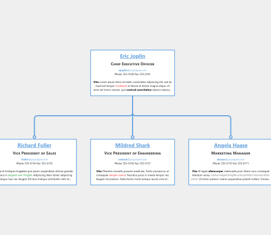

# Rich Text Label Demo

[You can also run this demo online](https://live.yworks.com/demos/style/richtextlabel/index.html).

# Rich Text Label Demo

This demo shows how to create labels with rich text features using `MarkupLabelStyle`.

The demo also utilizes [Quill](https://quilljs.com/), an open source WYSIWYG text editor that lets you easily edit labels in the graph.

## Label Editor

#### Creating and Editing Labels

Press F2 or double-click a label to open the text editor.

Note how the editor is hooked up with yFiles such that users don't need to write HTML markup themselves, but can rely on commonly known editor functions to format the text.

#### The MarkupLabelStyle

Internally, the HTML markup that is created from the Quill editor is added as an [ILabel](https://docs.yworks.com/yfileshtml/#/api/ILabel) with the [MarkupLabelStyle](https://docs.yworks.com/yfileshtml/#/api/MarkupLabelStyle) to the graph.

In general, the `MarkupLabelStyle` could also be used without a WYSIWYG editor. It supports the following tags:

- ``: A stylable element.
- ` `: Adds a line break
- `<em>`: Italic text
- `<strong>`: Bold text
- `<del>`: Strikethrough text
- `<u>`: Underline text
- `<h1>-<h6>`: Heading 1-6
- `
`: A paragraph element.
- `<pre>`: A preformatted element which preserves newlines.
- `<code>`: A code element.
- `<small>`: Small font-size
- `<large>`: Large font-size
- `<[html color name]>`: Colored text, e.g. <blue>

#### Styling Labels with CSS

Tags can be styled with inline CSS. Also tags can be given CSS classes to use external CSS.

The stylesheet for labels _markup-label.css_ shows how the label texts are styled with external CSS.

#### Text Wrapping

Markup labels can use line wrapping. In this demo application, the labels use word wrapping with ellipsis. Select and resize a node to observe the interactive text wrapping. Rich text labels can also be wrapped at character boundaries.
