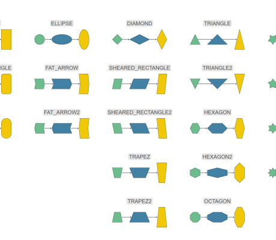

# Shape Node Style Demo

[You can also run this demo online](https://live.yworks.com/demos/style/shape-node-style/index.html).

# Shape Node Style Demo

This demo shows the main features of the [ShapeNodeStyle](https://docs.yworks.com/yfileshtml/#/api/ShapeNodeStyle) class, most notably its supported shapes and the shape-specific effects of [keepIntrinsicAspectRatio](https://docs.yworks.com/yfileshtml/#/api/ShapeNodeStyle#keepIntrinsicAspectRatio).

To illustrate the effects of the latter feature, three nodes with different aspect ratios are shown for each shape: green (1:1), blue (2:1) and yellow (1:2).

## Things to Try

- Observe how the shape is rendered depending on the node's aspect ratio.
- Select and resize nodes and observe how the shape changes.
- Observe how edges are cropped at the visual bounds of the nodes. Move nodes to see how cropping works for every point on the visual border.
- Enable and disable the [keepIntrinsicAspectRatio](https://docs.yworks.com/yfileshtml/#/api/ShapeNodeStyle#keepIntrinsicAspectRatio) property using the toggle button in the toolbar. Observe its effect for shapes with different width:height aspect ratios.

## Related Demos

- [Rectangle Node Style](../rectangle-node-style/index.html)
- [Group Node Style](../group-node-style/index.html)
- [Arrow Node Style](../arrow-node-style/index.html)
- [Tutorial: Custom Node Style](../../02-tutorial-custom-styles/01-custom-node-style/index.html)
