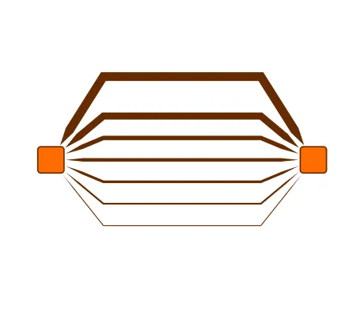

<!--
 //////////////////////////////////////////////////////////////////////////////
 // @license
 // This file is part of yFiles for HTML.
 // Use is subject to license terms.
 //
 // Copyright (c) by yWorks GmbH, Vor dem Kreuzberg 28,
 // 72070 Tuebingen, Germany. All rights reserved.
 //
 //////////////////////////////////////////////////////////////////////////////
-->
# Simple Arrow Style Demo

[You can also run this demo online](https://www.yworks.com/demos/style/simple-arrow-style/).

This demo shows how to create a simple custom arrow for edges.

## Things to Try

- Create new nodes and edges between nodes and inspect the custom style of the arrows in code.
- Save the graph to GraphML and take a look at the GraphML – the arrow styles are serialized using a custom markup extension and can be loaded back to the demo.

## Related Demos

- [Step 12 Custom Arrow](../../tutorial-style-implementation-edge/12-custom-arrow/)
