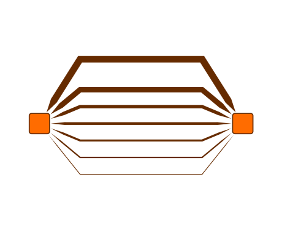

# Simple Arrow Style Demo

[You can also run this demo online](https://live.yworks.com/demos/style/simple-arrow-style/index.html).

# Simple Arrow Style Demo

This demo shows how to create a simple custom arrow for edges.

## Things to Try

- Create new nodes and edges between nodes and inspect the custom style of the arrows in code.
- Save the graph to GraphML and take a look at the GraphML – the arrow styles are serialized using a custom markup extension and can be loaded back to the demo.

## Related Demos

- [Tutorial: Custom Arrow](../../02-tutorial-custom-styles/20-custom-arrow/index.html)
- [Tutorial: Arrow Thickness](../../02-tutorial-custom-styles/22-arrow-thickness/index.html)
