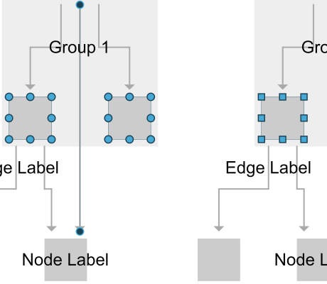

# Theming Demo

[You can also run this demo online](https://live.yworks.com/demos/style/theming/index.html).

# Theming Demo

This demo shows various interaction visualization [themes](https://docs.yworks.com/yfileshtml/#/dguide/customizing_view_theming) simultaneously.

Each graph component uses a different theme variant:

Top-left

[Simple round](https://docs.yworks.com/yfileshtml/#/api/ThemeVariant#SIMPLE_ROUND)

Top-right

[Simple square](https://docs.yworks.com/yfileshtml/#/api/ThemeVariant#SIMPLE_SQUARE)

Bottom-left

[Classic with non-default colors](https://docs.yworks.com/yfileshtml/#/api/ThemeVariant#CLASSIC)

Bottom-right

[Classic with default colors](https://docs.yworks.com/yfileshtml/#/api/ThemeVariant#CLASSIC)

## Things to Try

- Navigate/edit one graph component to see the changes mirrored in the other components.
- Choose a different color palette to use as the theme colors.
