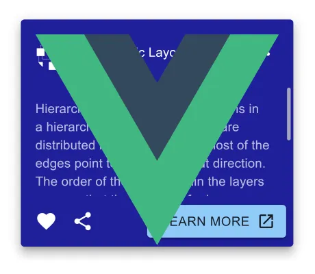

<!--
 //////////////////////////////////////////////////////////////////////////////
 // @license
 // This file is part of yFiles for HTML.
 // Use is subject to license terms.
 //
 // Copyright (c) 2026 by yWorks GmbH, Vor dem Kreuzberg 28,
 // 72070 Tuebingen, Germany. All rights reserved.
 //
 //////////////////////////////////////////////////////////////////////////////
-->

This demo presents the Vue.js component node style that uses a [Vue](https://vuejs.org/) component to visualize nodes.

To start the demo

1.  Go to the demo's directory `demos-ts/style/vue-component-node-style`.
2.  Run `npm install`.
3.  Run `npm run dev`.

This will compile the app and launch a dev server that will serve the demo application. Source code changes will be compiled and displayed automatically.
