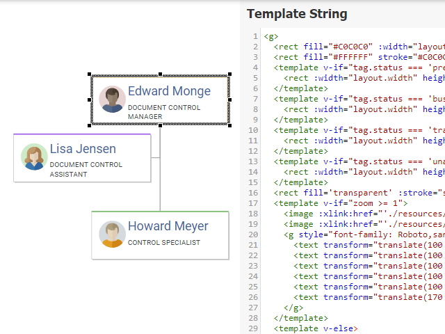

# Vue.js Template Node Style Demo

[You can also run this demo online](https://live.yworks.com/demos/style/vuejstemplatenodestyle/index.html).

This demo presents the Vue.js template node style that leverages the powerful data binding and condition rendering features of the [Vue.js framework](https://vuejs.org/v2/guide/index.html).

With this style, node visualizations are defined by SVG templates, similar to the template styles that are included in the library. However, since the templates of this style can use the powerful data binding of Vue.js, complex requirements are more easy to realize.

The section [Using Vue.js Templates in Node Styles](https://docs.yworks.com/yfileshtml/#/dguide/custom-styles_vuejs-template-styles) in the Developer's Guide elaborates on how to create template strings and which properties are available for data binding.

## Things to Try

Change the template of one or more nodes. Bind colors or text to properties in the tag. Then, apply the new template by pressing the button. Or modify the tag and see how the style changes.

## Related Documentation

- [Using Vue.js Templates in Node Styles](https://docs.yworks.com/yfileshtml/#/dguide/custom-styles_vuejs-template-styles)
- [Using SVG Templates in Styles](https://docs.yworks.com/yfileshtml/#/dguide/custom-styles_template-styles)

## Related Demos

- [Template Styles Demo](../../style/templatestyles/index.html)
- [Vue.js Template Node Style Demo](../../style/vuejstemplatenodestyle/index.html)

## Additional Tools

Graphs containing template node style are compatible with [yEd Live](https://www.yworks.com/yed-live/).
