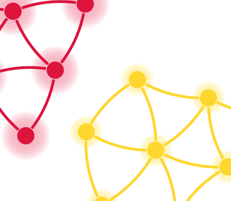

# WebGL2 Animations Demo

[You can also run this demo online](https://live.yworks.com/demos/style/webgl-animations/index.html).

This demo shows how to use WebGL2 animations to highlight interesting parts of a graph.

The graph consists of several components, which are calculated after loading the graph. These could also be calculated using the [ConnectedComponents](https://docs.yworks.com/yfileshtml/#/api/ConnectedComponents) class.

(A graph is called connected if there exists an undirected path of edges between every pair of nodes. The connected components of a graph are the maximal connected subgraphs of which the graph consists.)

The currently hovered component (or the rest of the graph) can be highlighted with various WebGL2 animation types.

Note, that the animated items all share the same [WebGL2Animation](https://docs.yworks.com/yfileshtml/#/api/WebGL2Animation) object.

## Things to try

- Hover over a component and observe the animation.
- Select different animations types for highlighting the currently hovered component:
- For the component itself, "Pulse" is a fitting animation.
- Use "Fade Out" or "Fade To Gray" animations for the rest of the graph to bring the component to attention.
- For fade animations, shorter animation durations are more noticeable.
- Experiment with other animation configurations, to achieve the desired effect.
