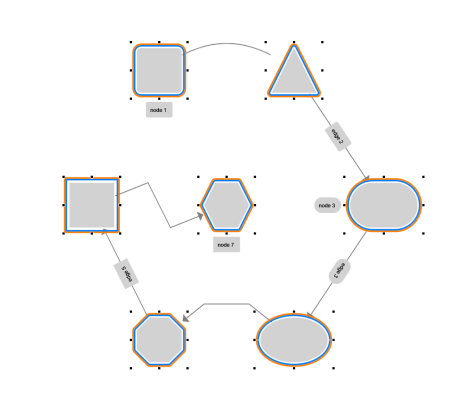

# WebGL2 Selection Styles Demo

[You can also run this demo online](https://live.yworks.com/demos/style/webgl-selection-styles/index.html).

# WebGL2 Selection Styles Demo

This demo shows the available _selection_ styles for nodes, edges, and labels in WebGL2 rendering.

In WebGL2, selections can be configured in various ways: There are multiple patterns to choose from, and colors, thickness, and margins are configurable. Additionally, selections can be activated and deactivated using animated transitions, and for the appropriate selection styles, a "marching ants" animation is available, too.

## Things to Try

- Configure the basic pattern used.
- Experiment with the primary and secondary color and how they are used in the various selection styles.
- Tweak the thickness and margin of the selection style.
- Activate transitions, select and deselect various graph elements.
- Activate the dash animation and select various graph elements.
- Observe that only styles with repeating patterns along the selection visualization are animated.
- Change the zoom policy and observe how the rendering of the selection is modified in the corresponding coordinate system.

In this demo, the same selection style is used for all graph elements. This is only a configuration in the demo, since with the API the styles for the different element types can be configured individually. See the _updateSelectionStyles_ function in the demo source code.
