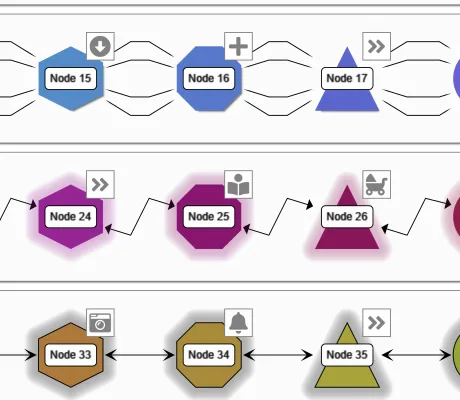

<!--
 //////////////////////////////////////////////////////////////////////////////
 // @license
 // This file is part of yFiles for HTML.
 // Use is subject to license terms.
 //
 // Copyright (c) by yWorks GmbH, Vor dem Kreuzberg 28,
 // 72070 Tuebingen, Germany. All rights reserved.
 //
 //////////////////////////////////////////////////////////////////////////////
-->
# WebGL Styles Demo

[You can also run this demo online](https://www.yworks.com/demos/style/webgl-styles/).

This demo shows the available styles for nodes, edges and labels in WebGL rendering.

The initial graph displays the various node shapes in the columns and the node effects, edge and arrow types in the rows.

The side panel shows the various configuration options for the graph items.

## Things to Try

- Click on a node, edge, or label to open the corresponding configuration options in the sidebar. Change the settings and observe how the selected graph items change.
- Create new nodes, edges, or labels. New items will use the current values from the corresponding configuration options in the sidebar.

### Note on Firefox

Firefox currently has a problem generating images from the Font Awesome glyphs used as image labels for the nodes. Please reload the demo to properly show the image labels.
