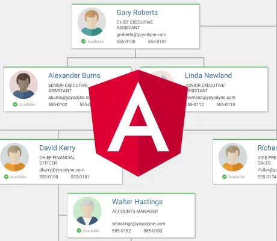

<!--
 //////////////////////////////////////////////////////////////////////////////
 // @license
 // This file is part of yFiles for HTML.
 // Use is subject to license terms.
 //
 // Copyright (c) by yWorks GmbH, Vor dem Kreuzberg 28,
 // 72070 Tuebingen, Germany. All rights reserved.
 //
 //////////////////////////////////////////////////////////////////////////////
-->

The Angular Demo shows the integration of yFiles for HTML with [Angular](https://angular.dev/).

To start the demo

1.  Go to the demo's directory `demos-ts/toolkit/angular`.
2.  Run `npm install`.
3.  Run `npm start`.

This will compile the app and launch a debugging server that will serve the demo application. Source code changes will be compiled and displayed automatically.
