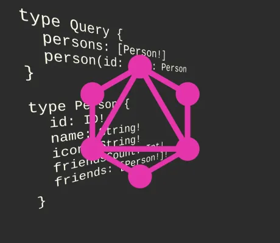

<!--
 //////////////////////////////////////////////////////////////////////////////
 // @license
 // This file is part of yFiles for HTML.
 // Use is subject to license terms.
 //
 // Copyright (c) by yWorks GmbH, Vor dem Kreuzberg 28,
 // 72070 Tuebingen, Germany. All rights reserved.
 //
 //////////////////////////////////////////////////////////////////////////////
-->
# GraphQL Demo



[You can also run this demo online](https://www.yfiles.com/demos/toolkit/graphql/).

This demo shows how to load data from a [GraphQL](https://www.graphql.org/) endpoint. You can navigate through a social network while lazily fetching new data.

## Things to Try

- Double click on persons to load their friends and expand the social network graph.
- Click on a node to see its properties on the Properties panel.
- Click the `Load complete graph` button to load the whole social network.
- Click the `Reset` button to reset the graph.

## Details

This demo fetches its data from the server using the [GraphQL](https://www.graphql.org/) query language. You can start the server by changing to the `./server/` directory and running

```
\> npm install
> npm start
```

The GraphQL endpoint defines this schema which models a social network with persons and their friends:

```
type Query {
  persons: [Person!]
  person(id: ID!): Person
}

type Person {
  id: ID!
  name: String!
  icon: String!
  friendsCount: Int!
  friends: [Person!]!
}
```

The client fetches its data lazily on demand: When nodes are expanded, it issues a query that only fetches the friends of the expanded person.

The GraphQL endpoint is a simple [Express](https://expressjs.com/) server that utilizes the [GraphQL reference implementation](https://github.com/graphql/graphql-js) and is backed by simple JSON data.

Have a look at the source code to see the specific GraphQL queries and backend implementation.
