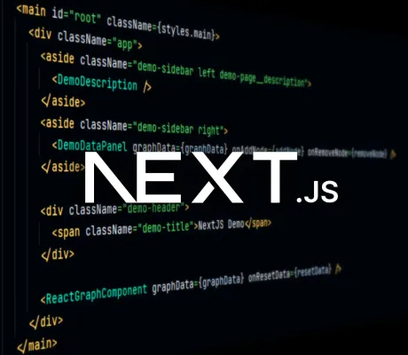

<!--
 //////////////////////////////////////////////////////////////////////////////
 // @license
 // This file is part of yFiles for HTML.
 // Use is subject to license terms.
 //
 // Copyright (c) 2026 by yWorks GmbH, Vor dem Kreuzberg 28,
 // 72070 Tuebingen, Germany. All rights reserved.
 //
 //////////////////////////////////////////////////////////////////////////////
-->

This demo shows how to integrate yFiles in a [Next.js](https://nextjs.org/) application with [TypeScript](https://www.typescriptlang.org/).

To start the demo

1.  Go to the demo's directory `demos-ts/toolkit/next`
2.  Run `npm install`
3.  Run `npm run dev`

This will start the development server of the toolkit.

The integrated development server of the project will automatically update the application upon code changes.

There are no special caveats that you need to look out for when you load yFiles as NPM dependency as in this demo application. However, we recommend including the [@yworks/optimizer](https://www.npmjs.com/package/@yworks/optimizer) when you deploy your app for production.

The optimizer will obfuscate the public API of the yFiles library files, as well as yFiles API usages in application sources.

We highly recommend obfuscating the yFiles for HTML library prior to deploying your application to a public web server to reduce the download size of the library for the end user. Note that, at the time of writing, you are not required to use obfuscation.
