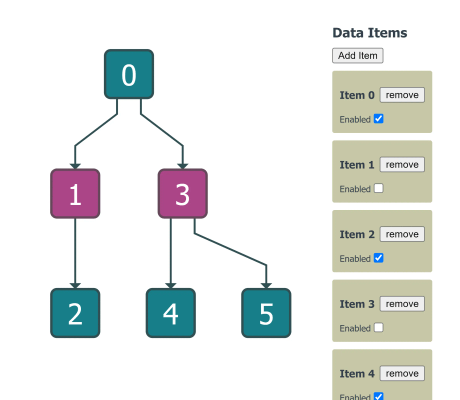

# Preact Demo

[You can also run this demo online](https://live.yworks.com/demos/toolkit/preact/index.html).

This demo shows how to integrate yFiles in a [Preact](https://preactjs.com/) application. It uses the ["No build tools route"](https://preactjs.com/guide/v10/getting-started#no-build-tools-route) of the preact setup for simplicity. Note that //@ts-ignore comments have to be used when importing from unpkg URLs, as TypeScript has no way of knowing the types of these packages. The interoperability between the yFiles graph view and the preact components that is demonstrated in this demo would not change with a different configuration setup, though (e.g. Preact CLI, custom bundling pipeline).

The sample application shows how a collection of data items and connections can be automatically synced with both a Preact view and a yFiles view.

To keep the yFiles view in sync with the application data, the yFiles [GraphBuilder](https://docs.yworks.com/yfileshtml/#/api/GraphBuilder) API is used.

The nodes are rendered via the `NodeTemplate` preact component.

## Things to Try

- The item collection can be changed with the panel on the right-hand side.
  - 'Add Item' creates a new data item and a random connection.
  - The item view contains a checkbox that toggles the item's "enabled" state.
  - Finally, items can also be removed in the Preact view.Note how all of these operations are synced with the yFiles view.
