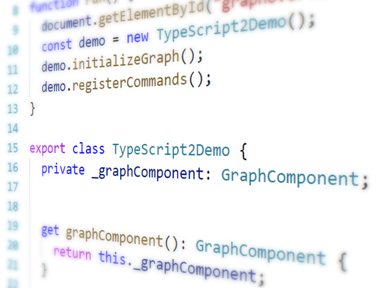

# Typescript Demo

The TypeScript Demo shows the integration of yFiles for HTML with [TypeScript](https://www.typescriptlang.org/).

To start the demo

1.  Go to the demo's directory `demos-js/toolkit/typescript`.
2.  Run `npm install`.
3.  Run `npm run build`.
4.  Open the `index.html` file.
