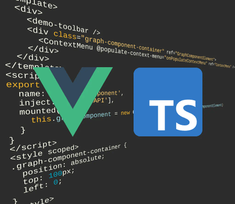

# Vue CLI (Vue 2) Demo

The Vue CLI (Vue 2) Demo shows how to integrate yFiles in a Vue 2 application with TypeScript built on a basic [Vue CLI](https://cli.vuejs.org/) setup.

To start the demo

1.  Go to the demo's directory `demos-ts/toolkit/vue2-cli-typescript`.
2.  Run `npm install`.
3.  Run `npm run serve`.

This will start the development server of the Vue CLI application.

The integrated development server of the project will automatically update the application upon code changes.
